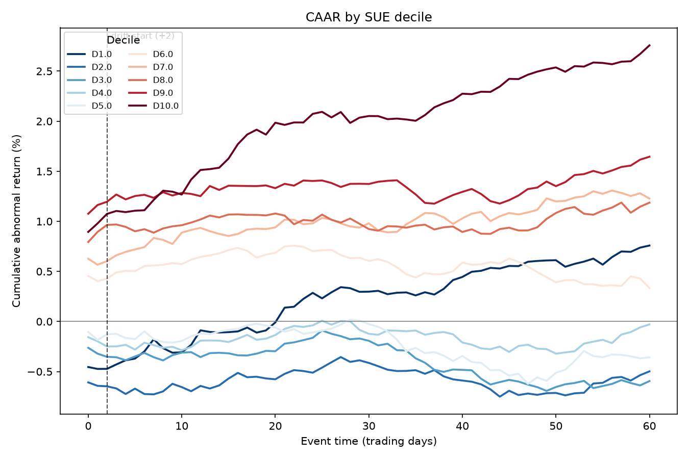

# Post-Earnings Announcement Drift in S&P 500 Constituents, 2015–2026

PEAD is among the most-replicated anomalies in accounting research. This
repository tests whether it remains present in S&P 500 large caps using
only free data — SEC EDGAR filings and Yahoo Finance prices. It is not
reliably present in this universe.

## Headline result



The long-short spread between the top and bottom surprise deciles over the
(+2, +60) drift window is 0.55%, with a naive t-statistic of 1.08 and a
clustered t-statistic of 1.02 once standard errors are clustered by
announcement date. The effect is not statistically distinguishable from
zero. After 25bp round-trip costs, the net spread is 0.05%.

| Cost (bps per leg) | Gross spread | Total cost | Net spread |
|---:|---:|---:|---:|
| 0  | 0.55% | 0.00% | 0.55% |
| 10 | 0.55% | 0.20% | 0.35% |
| 25 | 0.55% | 0.50% | 0.05% |

## Interpretation

Deciles 2 through 9 sort broadly monotonically at announcement and show
the expected fan pattern, so the effect is directionally present but too
weak to clear the noise bar in this universe. Both extreme deciles behave
non-monotonically. This is consistent with the literature: PEAD has
decayed since it was documented in the 1980s, and was always concentrated
in small, illiquid, under-covered stocks, which is precisely what the S&P 500
excludes.

## Data and method

469 S&P 500 constituents, 2015–2026, roughly 17,600 events. Earnings
announcements are identified as 8-K filings carrying Item 2.02, timestamped
from EDGAR acceptance times to assign the correct trading day. Surprise is
measured as the seasonal random walk change in diluted EPS scaled by
price, winsorised and ranked within calendar quarter. Abnormal returns are
market-adjusted against SPY. See `docs/methodology.md` for the full record
of modelling decisions.

## Limitations

- The universe is built from current index membership, introducing
  survivorship bias that likely understates drift.
- GAAP EPS surprise is contaminated by large one-off writedowns, which are
  real earnings events but poor proxies for earnings news.
- The large-cap-only universe is where PEAD is weakest.
- 36 companies were excluded for XBRL data issues; see
  `docs/methodology.md`.

## Rejected specification

A seasonal random walk with a drift term was tested and reduced the spread
to 0.19%, with a clustered t-statistic of 0.37, while degrading decile
monotonicity. Reported here for completeness; see `docs/methodology.md`
("Earnings expectation model").

## Reproducing

```
git clone <repo-url>
cd pead-event-study
pip install -r requirements.txt
pip install -e .
export EDGAR_UA="Your Name your@email.com"
python scripts/run_analysis.py
```

The first run takes roughly 25 minutes to build the EDGAR and price
caches.
